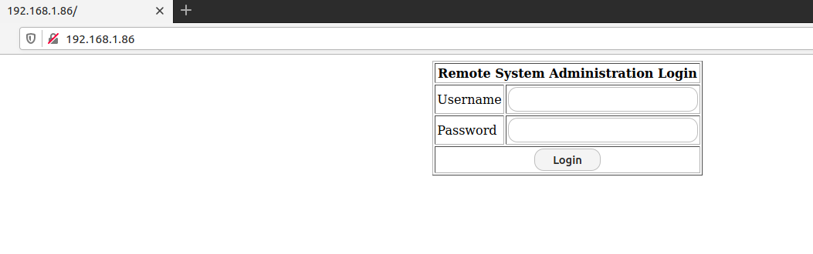
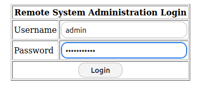

#KIOPTRIX 1.1 WRITEUP

This is a Boot2Root Machine

Download and Extract the RAR file

And launch it in the VM

It shows that it is running on CentOS 4.5

-----

Make sure that you are connected to the host in Bridged Mode

Lets check the ARP table to find the IP address

We got the IP address

Now lets scan the IP using nmap

-----

We can't enumerate SSH port without sufficient details,so skip this

Port80 is opened and interesting

In Port3306 it runs MySQL

In Port443 We get 400 Bad Request

Others are not helpful

-----

Now in Port80,

There is a login page (index.php)

To find more directories, I ran gobuster 

No luck  with the found directories :-(

Back to main page

-----

Now we dont know the credentials for the login page

But we do know the page is for admin-panel

Lets assume our user is "admin"

I bypassed the login page with simple SQLi

uname:admin
psw: ' or 1=1-- 

We BYPASSED

To automate it,We can also use SQLmap to get passwords

The DB its running is MySQL

-----

After bypassing,

We can see the input field is similar to command injection

The "index.php" page redirects us to "pingit.php"

Where it gives the ping result of given host value in input field

So i passed inputs with

google.com;ls

Bingo!we got the files listed in the directory

Lets pass id,

-----

So to get a shell to work with,lets pass a bash reverse shell one liner

Lets open netcat and start listening

When we submit the command in input field, the page keeps on loading and we get a shell

----

Now our main task is to elevate our privileges to #ROOT user

So first lets check ,is there any SUID binaries or not

No luck :-(

Lets see "sudo -l" is available or not

No luck :-(

Lets gather the kernel info

Lets search if there is any exploit available for this CentOS 4.5 Kernel in Searchsploit

Copy this to a location and launch HTTP server using python

Using wget, download the exploit file

Compile the exploit to binary

Lets move to /tmp where there will be no restrictions

-----

Once the exploit is executed

We get the #ROOT shell

