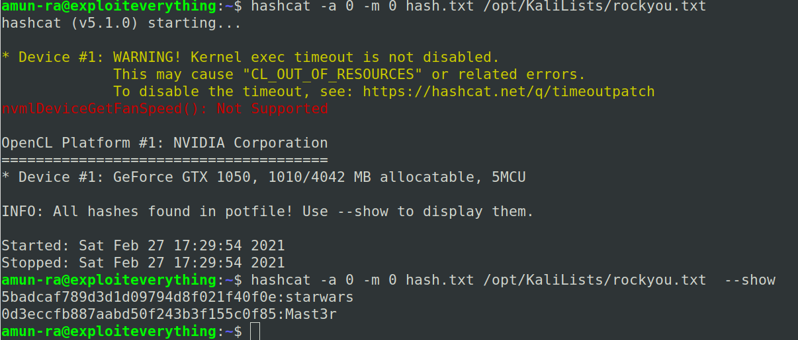

#KIOPTRIX 1.2 WRITEUP

Download and extract the RAR file

Open the Box in VM

Make sure that you are connected in Bridged Mode

-----

Lets use ARP table to find the IP address

Lets add the IP with the hostname in /etc/hosts

hostname=kioptrix3.com (Given in description)

-----

Lets scan the IP with nmap

Port22 cannot be used without proper credentials

Port80 displays a webpage

-----

Lets run gobuster to find directories on Port80

Enumerated the directories,

/gallery seems interesting

-----

Lets use searchsploit with gathered service versions

We didn't get any exploits

-----

Lets test the login page,

So,it runs on LotusCMS

There is an exploit for LotusCMS but it doesn't work for this case

-----

Tried SQLi

But it failed :-(

-----

Lets move on to /gallery

Here there are many photos

By viewing the recent photos,

We can sort the 3 photos based on various category

When i pass id=1 as id=1' to check SQLi

It breaks, resulting an SQL error in the page

So,we need to run SQLmap

sqlmap -u "http://kioptrix3.com/gallery/gallery.php?id=1&sort=filename#photos" --dbms=MySQL --dbs

It lists the DB in the SQL 

Now,we scan for 'gallery' to list the tables in it

sqlmap -u "http://kioptrix3.com/gallery/gallery.php?id=1&sort=filename#photos" --dbms=MySQL -D gallery --tables

Lets see tha values in the 'dev_accounts' from 'gallery'

sqlmap -u "http://kioptrix3.com/gallery/gallery.php?id=1&sort=filename#photos" --dbms=MySQL --D gallery -T dev_accounts --dump

We get the hash of user's passwords

If you want to crack it automatically with SQLmap pass it with dictionary attack

I use hashcat to crack it

We got the passwords for the usernames

-----

I tried logging in the LotusCMS login panel

But it failed

So it should be credentials for SSH

----

For user dreg,

Scan for privileges with sudo -l

Even SUID binaries didn't give luck

-----

For user loneferret,

It seems that we can run /usr/local/bin/ht with sudo

"sudo ht"

Tested that we can run /bin/sh and /bin/bash with sudo..failed :-(

Ran "sudo ht"..failed

Set the ENV value of TERM to "xterm"

-----

Now run "sudo ht"

It opens HT editor with #root privileges,

So we can edit any file using #root privileges

Lets go for "/etc/sudoers"

Add /bin/sh or whatever program you want to launch with sudo by loneferret

Save the file and exit

(HT editor commands reffered from net Alt+F3 to open file)

-----

Then in terminal launch your desired shell

GOT #ROOT SHELL

