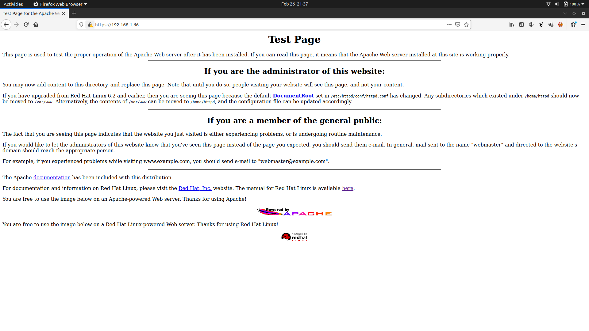

#VULNHUB-KIOPTRIX 1 WRITEUP 

This is a beginner level boot2root box

Download and extract the box

Launch it in VM

Make sure that you are connected to the VM in Bridged Mode

-----

This is how the login screen looks

Lets scan the IP from ARP table

We got our IP

-----

Lets enumerate this IP using nmap

Enabling Service Version Detection , Script Scanning and Aggresive Scan

These ports are available

-----

Our pitfalls,

SSH can't be acessed and we don't know its username yet , so can't be used

Port 80 , looks like normal apache server page

Ran gobuster on Port 80 with directory-list-2.3-medium.txt nothing came

Port 111 & Port 1024 - No clue

---

Ran port 443 on browser

It showed like this

It seems like there should be 'https://' in the url as it is mentioned in the page

After adding 'https://' and reloading it

It loaded like a normal apache server home page

But the SSL/TLS lock icon looks different

-----

Use searcshploit on Apache 1.3.20

Many results came

To narrow it down ,

Use searchsploit on mod_ssl 2.8.4

It shows OpenFuck exploit 

----

But the exploits available in Searchsploit and ExploitDB are outdated and not configured properly

Lets use OpenFuck Git Repo

Follow the steps in their repo

-----

Running the exploit,

It shows all possible values for every OS supported by it

We know the box runs on RedHat Linux 7.2 with Apache 1.3.20

It show two possible values

Lets try both

So this first value fails, lets try the second one

We got the $shell

And we are #ROOT in it

